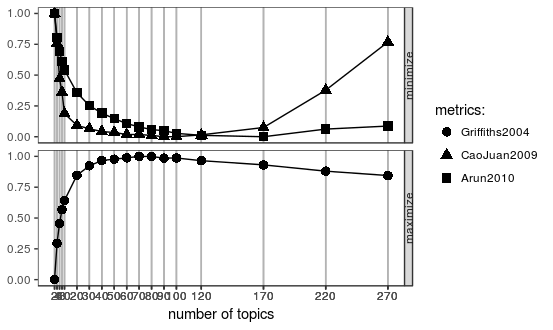

```{r setup, include=FALSE}
knitr::opts_chunk$set(
	echo = FALSE,
	message = FALSE,
	warning = FALSE,
	cache = TRUE,
	collapse = TRUE,
	fig.align = "center",
	fig.width = 8,
	comment = "#>"
)
```

```{r, cache=FALSE, include=FALSE}
library(magrittr)
library(data.table)
library(dplyr)
library(dtplyr)
library(readr)
library(stringr)
library(tm) # install.packages("slam", type = "binary")
library(text2vec)
library(jiebaR) # word segmentation
library(wordcloud2)
# library(topicmodels)
# http://stackoverflow.com/questions/24172188/how-can-i-install-topicmodels-package-in-r
library(ldatuning) # Select number of topics for LDA model # sudo apt install libmpfr-dev
library(lda)
library(wordVectors) # devtools::install_github("bmschmidt/wordVectors")
library(ggplot2)
library(feather)
library(DT)
library(corrr) # for corr plot
library(Matrix) # for Sparse Matrix
library(slam)
library(lubridate)
library(viridis)
invisible(
  lapply(list.files("utils", pattern = "\\.[Rr]$", full.names = TRUE), 
         function(x) {source(x, encoding = "UTF-8"); invisible()})
)
# devtools::install_github("qinwf/ropencc") # 繁簡轉換
```

## Data Source

```{r, include=FALSE, cache=TRUE}
gay_dt <- fread("data/ptt_gay_20170227.csv")
lesbian_dt <- fread("data/ptt_lesbian_20170227.csv")
ptt_dt <- rbindlist(list(gay_dt, lesbian_dt))
rm(gay_dt, lesbian_dt)

# Data Cleansing

# Add category
ptt_dt[, category := 
         stringr::str_extract(title, "\\[([^]]+?)\\]")]

# time
ptt_dt[, `:=`(post_time = post_time %>% 
                strptime("%a %b %d %T %Y", tz = "ROC") %>% 
                as.POSIXct)]
ptt_dt[, `:=`(post_time = ifelse(
  post_time >= as.POSIXct("1990-01-01","ROC") %>% as.numeric(),
  post_time, NA))]
ptt_dt[, `:=`(post_time = post_time %>% 
                 as.POSIXct(tz = "ROC", origin = "1970-01-01"))]
# Clean text
ptt_dt[, post_text := post_text %>% str_replace_all("※ 引述.+?之銘言：\n", "")]
ptt_dt[title %>% str_detect("^Fw:"), 
       post_text := post_text %>%
         str_replace_all("(?m)^(?:※ \\[本文轉錄|作者:|標題:|時間:).*$", "") %>%
         str_trim()]
ptt_dt[title %>% str_detect("^Re:"), 
       post_text := post_text %>%
         str_replace_all("(?m)^:(.*)$", "") %>% str_trim()]
# ptt_dt[, post_text := post_text %>%
#          str_replace("(?ism).*Ctrl\\s?[+]\\s?Y.*?$", "")]
ptt_dt[category=="[活動]", post_text := post_text %>%
         str_replace("(?s)^.*Y 刪除[\\s=]+", "")]
ptt_dt[category=="[尋人]", post_text := post_text %>%
         str_replace("(?s)^.*可快速刪除整行文字\\)\\s*", "")]
ptt_dt[, post_text := post_text %>%
         str_replace_all("[^\\w\\s\u4E00-\u9FD5]", " ")]
ptt_dt[, push_text := push_text %>%
         str_replace_all("[^\\w\\s\u4E00-\u9FD5]", " ")]

# remove url
url_re <- "((([A-Za-z]{3,9}:(?:\\/\\/)?)(?:[\\-;:&=\\+\\$,\\w]+@)?[A-Za-z0-9\\.\\-]+|(?:www\\.|[\\-;:&=\\+\\$,\\w]+@)[A-Za-z0-9\\.\\-]+)((?:\\/[\\+~%\\/\\.\\w\\-_]*)?\\??(?:[\\-\\+=&;%@\\.\\w_]*)#?(?:[\\.\\!\\/\\\\\\w]*))?)"
ptt_dt[, post_text := post_text %>% str_replace_all(url_re, "")]
ptt_dt[, push_text := push_text %>% str_replace_all(url_re, "")]


# filter time
min_time <- ptt_dt[, .(min_time = min(post_time, na.rm=T)), by = .(board)][
  , max(min_time)]
ptt_dt <- ptt_dt[post_time >= min_time]
```

- 來源：PTT- gay, lesbian 板
- 期間：`r min(ptt_dt$post_time, na.rm=T)` - `r max(ptt_dt$post_time, na.rm=T)`
- 文本數量
    - gay 板: `r ptt_dt[board=="gay", .N]` 篇文章
    - lesbian 板: `r ptt_dt[board=="lesbian", .N]` 篇文章

## 文章標題分析

### 文章種類 Top 30

```{r, fig.asp=0.75}
dt <- ptt_dt[!is.na(category), .N, by = .(board, category)][
  order(-N), head(.SD, 30), by = .(board)][
    order(board, N)][, order := 1:.N]
dt %>% ggplot(aes(order, N)) +
  geom_bar(stat = "identity") +
  geom_text(aes(label = N, hjust = -.2)) +
  facet_wrap(~ board, scales = "free_y") +
  scale_x_continuous(
    breaks = dt$order,
    labels = dt$category,
    expand = c(0,0)
  ) +
  # scale_y_continuous(expand = c(20, 0)) +
  expand_limits(y=c(0, 9000)) +
  xlab("文章類別") + ylab("文章數") +
  ggtitle("PTT - gay, lesbian 板文章類別") +
  labs(caption = paste("期間:", min(ptt_dt$post_time, na.rm=T) %>% date, "-", max(ptt_dt$post_time, na.rm=T) %>% date)) +
  coord_flip() +
  theme_light() +
  theme(text = element_text(family = "STHeiti"))
```

### PTT gay 發文種類分佈

```{r, fig.width=12, fig.asp=0.8}
top20 <- ptt_dt[board=="gay"][!is.na(category), .N, by = .(category)][order(-N)] %>% head(20)
d <- ptt_dt[board=="gay"][category %in% top20$category, .(category, post_time)][
  , category := factor(category, levels = top20$category)][
    , post_date := as.Date(post_time)]
ggplot(d, aes(x = post_date, color = category, fill = category)) +
  # stat_density(geom = "area", alpha = 0.2) +
  stat_bin(binwidth = 30, geom = "area", alpha = 0.2) +
  # scale_color_brewer(palette = "Set2") +
  # scale_fill_brewer(palette = "Set2") +
  scale_x_date(date_breaks = "6 month", date_labels = "'%y-%m") +
  ggtitle("PTT gay 發文種類分佈") +
  guides(color = guide_legend(title = NULL, label.position = "top", 
                              nrow=2, byrow = TRUE),
         fill = FALSE) +
  facet_wrap(~ category, ncol = 4) +
  theme_bw() +
  theme(legend.position="none", 
        text = element_text(family = "STHeiti", size = 13))
```

### PTT lesbian 發文種類分佈

```{r, fig.width=12, fig.asp=0.8}
top20 <- ptt_dt[board=="lesbian"][!is.na(category), .N, by = .(category)][order(-N)] %>% head(20)
d <- ptt_dt[board=="lesbian"][category %in% top20$category, .(category, post_time)][
  , category := factor(category, levels = top20$category)][
    , post_date := as.Date(post_time)]
ggplot(d, aes(x = post_date, color = category, fill = category)) +
  # stat_density(geom = "area", alpha = 0.2) +
  stat_bin(binwidth = 30, geom = "area", alpha = 0.2) +
  # scale_color_brewer(palette = "Set2") +
  # scale_fill_brewer(palette = "Set2") +
  scale_x_date(date_breaks = "6 month", date_labels = "'%y-%m") +
  ggtitle("PTT lesbian 發文種類分佈") +
  guides(color = guide_legend(title = NULL, label.position = "top", 
                              nrow=2, byrow = TRUE),
         fill = FALSE) +
  facet_wrap(~ category, ncol = 4) +
  theme_bw() +
  theme(legend.position="none", 
        text = element_text(family = "STHeiti", size = 13))
```

## Text Mining

```{r tm functions, include=FALSE}
## 起手式，結巴建立斷詞器
mix_seg <- worker(type = "mix",
                  user = "utils/user_dict_utf8.txt",
                  stop_word = "utils/stop_utf8.txt",
                  symbol = FALSE,
                  encoding = "UTF-8")
# hmm_seg <- worker(type = "hmm",
#                   user = "utils/user_dict_utf8.txt",
#                   stop_word = "utils/stop_utf8.txt",
#                   symbol = FALSE,
#                   encoding = "UTF-8")
mix_seg <= ptt_dt[, post_text][1000] # try first post
# hmm_seg <= ptt_dt[, post_text][1]

# self-made filter (built-in perl's regular expression has bug)
cutter <- function (text, worker) {
  # text = "馬英九去世新大學演講"
  if (text %in% c(".", "")) {
    return(NA_character_)
  }
  
  filter_words = c(
    "推文", "站內信", "其他", "推",
    "我.?","他.?","你.?", "想說", "本報記者",
    "所以","可以","沒有","不過","因為",
    "還是","覺得","大家","比較","感覺","時候","現在","時間",
    "可能","東西","然後","而且","自己","有點",
    "這邊","那.","發現","雖然","不要","還是",
    "一樣","知道","看到","真的","今天","就是","這樣","如果",
    "不會","什麼","後來","問題","之前","只是","或是","的話",
    "其他","這麼","已經","很多","出來","整個","但是","卻",
    "偏偏","如果","不過","因此","或","又","也","其實",
    "希望","結果","怎麼","當然","有些","以上","另外","此外",
    "以外","裡面","部分","直接","剛好","由於",
    "原本","標題","時間","日期","作者","這種","表示","看見",
    "似乎","一半","一堆","反正","常常","幾個","目前","上次",
    "公告","只好","哪裡","一.","怎麼","好像","結果",
    "而已", "居然", "謝謝","請問","大大","小弟", "文章代碼",
    "po","xd","應該","最後","有沒有","sent","from","my",
    "Android", "JPTT", "如提","如題","編輯","引述","銘言","站內信",
    "記者",
    "中心","之.","指出","朋友",
    "了","也","的","在","與","及","等","是","the","and",
    "月", "年", "日", "時", "NA",
    "\\s",
    "[a-zA-Z]",
    "[0-9]"
  )
  pattern <- sprintf("^%s", paste(filter_words, collapse = "|^"))
  tryCatch({
    text_seg <- mix_seg <= text
  }, error = function(e) {
    stop('"', text, '" >> ', e)
  })
  filter_seg <- text_seg[!stringr::str_detect(text_seg, pattern)]
  filter_seg
}
```

### 關鍵詞 Top 100

利用 tf-idf 關鍵詞算法，處理高頻詞高估及低頻詞低估的問題，取得整個文檔的關鍵詞


#### [平權] 類別

```{r, include=FALSE}
# segment
library(parallel)
cl <- makeCluster(detectCores()-1)
clusterEvalQ(cl, {
  library(stringr)
  library(jiebaR)
  mix_seg <- worker(type = "mix",
                  user = "utils/user_dict_utf8.txt",
                  stop_word = "utils/stop_utf8.txt",
                  symbol = FALSE,
                  encoding = "UTF-8")
})
clusterExport(cl, list("cutter"))

post_text_seg <- ptt_dt[category == "[平權]", post_text] %>% 
  parLapply(cl, ., cutter) %>% 
  parLapply(cl, ., function(x) x[!is.na(x)])
stopCluster(cl)
# adjust to the format for text2vec::itoken
post_text_token <- itoken(post_text_seg)
```

```{r, include=FALSE}
# unique word matrix
vocab <- create_vocabulary(post_text_token, ngram=c(1L, 2L))
# dtm
vectorizer <- vocab_vectorizer(vocab)
dtm <- create_dtm(post_text_token, vectorizer)
# remove 1-word term
dtm <- dtm[, dtm %>% colnames() %>% nchar >= 2]

# dtm %>% find_freq_terms(30) # not good

## tf-idf
# define tfidf model
tfidf = TfIdf$new()
# fit model to train data and transform train data with fitted model
dtm_train_tfidf = fit_transform(dtm, tfidf)
# tfidf modified by fit_transform() call!
```

```{r}
key_term <- dtm_train_tfidf %>% 
  find_freq_terms(lowfreq = 1) %>% 
  colSums() %>% 
  data.frame() %>% 
  data.table(keep.rownames = TRUE) %>% 
  setnames(c("keyword", "sum_tf_idf")) %>% 
  .[order(-sum_tf_idf)]
key_term %>% head(100) %>% DT::datatable(extensions = "Responsive")
```

- Wordcloud

```{r}
d <- key_term %>% head(200)
ncolor <- nrow(d)
getPalette = colorRampPalette(RColorBrewer::brewer.pal(8, "Set2"))
wordcloud2(d, 
           size = 0.5,
           fontFamily = "Noto Sans CJK TC", 
           fontWeight = "normal",
           rotateRatio = 0,
           color = getPalette(ncolor),
           shape = "circle")
```

#### [新聞] 類別

```{r, include=FALSE}
# segment
library(parallel)
cl <- makeCluster(detectCores()-1)
clusterEvalQ(cl, {
  library(stringr)
  library(jiebaR)
  mix_seg <- worker(type = "mix",
                  user = "utils/user_dict_utf8.txt",
                  stop_word = "utils/stop_utf8.txt",
                  symbol = FALSE,
                  encoding = "UTF-8")
})
clusterExport(cl, list("cutter"))

post_text_seg <- ptt_dt[category == "[新聞]", paste(post_text, push_text)] %>% 
  parLapply(cl, ., cutter) %>% 
  parLapply(cl, ., function(x) x[!is.na(x)])
stopCluster(cl)
# adjust to the format for text2vec::itoken
post_text_token <- itoken(post_text_seg)
```

```{r, include=FALSE}
# unique word matrix
vocab <- create_vocabulary(post_text_token, ngram=c(1L, 2L))
# dtm
vectorizer <- vocab_vectorizer(vocab)
dtm <- create_dtm(post_text_token, vectorizer)
# remove 1-word term
dtm <- dtm[, dtm %>% colnames() %>% nchar >= 2]

# dtm %>% find_freq_terms(30) # not good

## tf-idf
# define tfidf model
tfidf = TfIdf$new()
# fit model to train data and transform train data with fitted model
dtm_train_tfidf = fit_transform(dtm, tfidf)
# tfidf modified by fit_transform() call!
```

```{r}
key_term <- dtm_train_tfidf %>% 
  find_freq_terms(lowfreq = 2) %>% 
  colSums() %>% 
  data.frame() %>% 
  data.table(keep.rownames = TRUE) %>% 
  setnames(c("keyword", "sum_tf_idf")) %>% 
  .[order(-sum_tf_idf)]
key_term %>% head(100) %>% DT::datatable(extensions = "Responsive")
```

- Wordcloud

```{r}
d <- key_term %>% head(200)
ncolor <- nrow(d)
getPalette = colorRampPalette(RColorBrewer::brewer.pal(8, "Set2"))
wordcloud2(d, 
           size = 0.5,
           fontFamily = "Noto Sans CJK TC", 
           fontWeight = "normal",
           rotateRatio = 0,
           color = getPalette(ncolor),
           shape = "circle")
```

#### 全部文章

(排除文章類別)

```{r}
c("[公告]", "[尋人]", "[自介]", "[她介]", "[他介]", 
  "[創作]", "[租屋]", "[Line]", "[line]", "[群組]",
  "[問卷]", "[Line群]", "[徵人]", "[活動]")
```

```{r, include=FALSE}
# segment
library(parallel)
cl <- makeCluster(detectCores()-1)
clusterEvalQ(cl, {
  library(stringr)
  library(jiebaR)
  mix_seg <- worker(type = "mix",
                  user = "utils/user_dict_utf8.txt",
                  stop_word = "utils/stop_utf8.txt",
                  symbol = FALSE,
                  encoding = "UTF-8")
})
clusterExport(cl, list("cutter"))

post_text_seg <- ptt_dt[
  !category %in% c("[公告]", "[尋人]", "[自介]", "[她介]", "[他介]",
                   "[創作]", "[租屋]", "[Line]", "[line]", "[群組]",
                   "[問卷]", "[Line群]", "[徵人]", "[活動]"), 
  paste(post_text, push_text)] %>% 
  parLapply(cl, ., cutter) %>% 
  parLapply(cl, ., function(x) x[!is.na(x)])
stopCluster(cl)
# adjust to the format for text2vec::itoken
post_text_token <- itoken(post_text_seg)
```

```{r, include=FALSE}
# unique word matrix
vocab <- create_vocabulary(post_text_token, ngram=c(1L, 2L), sep_ngram = "")
# dtm
vectorizer <- vocab_vectorizer(vocab)
dtm <- create_dtm(post_text_token, vectorizer)
# remove 1-word term
dtm <- dtm[, dtm %>% colnames() %>% nchar >= 2]

# dtm %>% find_freq_terms(30) # not good

## tf-idf
# define tfidf model
tfidf = TfIdf$new()
# fit model to train data and transform train data with fitted model
dtm_train_tfidf = fit_transform(dtm, tfidf)
# tfidf modified by fit_transform() call!
```

```{r}
key_term <- dtm_train_tfidf %>% find_freq_terms(3) %>% 
  colSums() %>% 
  data.frame() %>% 
  data.table(keep.rownames = TRUE) %>% 
  setnames(c("keyword", "sum_tf_idf")) %>% 
  .[order(-sum_tf_idf)]
key_term %>% head(100) %>% DT::datatable(extensions = "Responsive")
```

- Wordcloud

```{r}
d <- key_term %>% head(200)
ncolor <- nrow(d)
getPalette = colorRampPalette(RColorBrewer::brewer.pal(8, "Set2"))
wordcloud2(d, 
           size = 0.5,
           fontFamily = "Noto Sans CJK TC", 
           fontWeight = "normal",
           rotateRatio = 0,
           color = getPalette(ncolor),
           shape = "circle")
```

### Topic Models

```{r, eval=FALSE}
# Preprocessing ------------------------------------------------

doc.list <- post_text_seg

## tf-idf
# define tfidf model
tfidf = TfIdf$new()
# fit model to train data and transform train data with fitted model
dtm_train_tfidf = fit_transform(dtm, tfidf)
# tfidf modified by fit_transform() call!

l1 <- dtm_train_tfidf %>% find_freq_terms(lowfreq = 5) %>% 
  colSums() %>% median()
l1_terms <- (dtm_train_tfidf %>% find_freq_terms(lowfreq = 5) %>% 
  colSums() > l1) %>% names

# compute the table of terms:
# term.table <- dtm %>% slam::col_sums()
# term.table <- sort(term.table, decreasing = TRUE)
term.table <- setNames(vocab$vocab$terms_counts, vocab$vocab$terms)
del <- term.table < 5
term.table <- term.table[!del]
vocab_ <- names(term.table)

# remove terms that are stop words or occur fewer than 5 times:
# del <- term.table < 5
# term.table <- term.table[!del]
# vocab <- names(term.table)

get_terms <- function(doc.list, vocab) {
  index <- match(doc.list, vocab)
  index <- index[!is.na(index)]
  rbind(as.integer(index - 1), as.integer(rep(1, length(index))))
}
documents <- mclapply(doc.list, get_terms, vocab=vocab_, mc.cores = 3)

# Compute some statistics related to the data set:
D <- length(documents)  # number of documents (2,000)
W <- length(vocab_)  # number of terms in the vocab (14,568)
doc.length <- sapply(documents, function(x) sum(x[2, ]))  # number of tokens per document [312, 288, 170, 436, 291, ...]
N <- sum(doc.length)  # total number of tokens in the data (546,827)
term.frequency <- as.integer(term.table)  # frequencies of terms in the corpus
```

```{r, eval=FALSE}
# 跑個模擬，挑一個好的主題數 -----------------------------------

library(parallel)
cl <- makeCluster(detectCores()-1)
clusterEvalQ(cl, {
  library(stringr)
  library(jiebaR)
  mix_seg <- worker(type = "mix",
                  user = "utils/user_dict_utf8.txt",
                  stop_word = "utils/stop_utf8.txt",
                  symbol = FALSE,
                  encoding = "UTF-8")
})
clusterExport(cl, list("cutter"))

doc.list <- ptt_dt[
  !category %in% c("[公告]", "[尋人]", "[自介]", "[她介]", "[他介]",
                   "[創作]", "[租屋]", "[Line]", "[line]", "[群組]",
                   "[問卷]", "[Line群]", "[徵人]", "[活動]"), 
  paste(post_text, push_text)] %>% 
  parLapply(cl, ., cutter) %>% 
  parLapply(cl, ., function(x) x[!is.na(x)])
stopCluster(cl)
# doc.list <- ptt_dt[, post_text] %>% 
#   mclapply(cutter, worker = mix_seg, mc.cores = 3) %>% 
#   mclapply(function(x) x[!is.na(x)], mc.cores = 3) 
dtm <- doc.list %>% seglist_to_dtm %>% filter_tfidf_dtm

# https://cran.r-project.org/web/packages/ldatuning/vignettes/topics.html
tic <- Sys.time()
result <- FindTopicsNumber(
  dtm,
  topics = c(seq(2, 6, by = 2),
             seq(10, 60, by = 5),
             seq(60, 100, by = 10)#,
             #seq(120, 200, by = 20)
             ),
  metrics = c("Griffiths2004", "CaoJuan2009", "Arun2010"),
  method = "Gibbs",
  control = list(seed = Sys.time() %>% as.numeric()),
  mc.cores = 3L,
  verbose = TRUE
)
Sys.time() - tic # Time difference of 6.425704 hours
save(result, file = "models/lda_sim_result.RData")
load("models/lda_sim_result_all.RData")
FindTopicsNumber_plot(result)
```



```{r, eval=FALSE}
# Topic Model ----------------------------------

# vocab_temp <- dtm_train_tfidf %>% filter_tfidf_dtm() %>% colnames()
# term.table <- vocab_tbl$vocab %>% 
#   data.table() %>% 
#   .[terms %in% vocab_temp && terms >= 2]
# term.frequency <- term.table[, terms_counts]
# vocab <- term.table[, terms]


# MCMC and model tuning parameters:
K <- 70  # n_topic
G <- 3000 # num.iterations
alpha <- 0.02
eta <- 0.02

# Fit the model:
set.seed(2016)
t1 <- Sys.time()
lda_fit <- lda.collapsed.gibbs.sampler(
  documents = documents, K = K, vocab = vocab_, 
  num.iterations = G, alpha = alpha, 
  eta = eta, initial = NULL, burnin = 0,
  compute.log.likelihood = TRUE)
t2 <- Sys.time()
t2 - t1  # about 2.899927 mins on server

# Save Result
save(lda_fit, file = "./models/ptt_gay_les_lda_fit.RData")
```

根據指標選擇 70 個 topic cluster

**Result**

```{r lda result, cache=FALSE}
library(lda)
load("./models/ptt_gay_les_lda_fit.RData")
# Top topic result
top_docs_num <- lda_fit$document_sums %>% top.topic.documents(5)
top_words_df <- lda_fit$topics %>% 
  top.topic.words(num.words = 8, by.score = TRUE) %>% 
  data.frame() %>% setDT() %>% transpose()
row.names(top_words_df) <- paste0("topic_", seq(nrow(top_words_df)))
top_words_df %>% DT::datatable()
```

## word2vec

```{r, eval=FALSE}
library(wordVectors)

# Prepare tokenizes text file
ptt_split <- post_text_seg %>% sapply(paste, collapse = " ")
ptt_split %>% write_lines("data/tokenized/ptt_gay_les_split.txt")

# Fit models
tic <- Sys.time()
vector_set <- train_word2vec(train_file = "data/tokenized/ptt_gay_les_split.txt",
                             output_file = "models/ptt_gay_les_word2vec.bin",
                             force = TRUE,
                             vectors = 100,
                             threads = parallel::detectCores()-1,
                             window = 12)
print(Sys.time() - tic)
```
```{r, include=FALSE}
library(wordVectors)
vector_set <- read.vectors("models/ptt_gay_les_word2vec.bin")
```

### 相近關聯詞

- 同志婚姻

```{r}
nearest_to(vector_set, vector_set[["同志婚姻"]], n = 20)
```

- 平權

```{r}
nearest_to(vector_set, vector_set[["平權"]], n = 20)
```

- 旅遊

```{r}
nearest_to(vector_set, vector_set[["旅遊"]], n = 20)
```

- 消費

```{r}
nearest_to(vector_set, vector_set[["消費"]], n = 20)
```

- 核心人物

```{r}
nearest_to(vector_set, vector_set[["核心人物"]], n = 20)
```

- 四叉貓

```{r}
nearest_to(vector_set, vector_set[["四叉貓"]], n = 20)
```

- 萌萌

```{r}
nearest_to(vector_set, vector_set[["萌萌"]], n = 20)
```


### 向量 (根據文字向量距離由小至大排列)

- 四叉貓：八卦= 趙曉音：？

```{r}
nearest_to(vector_set,
vector_set[["四叉貓"]] - vector_set[["八卦"]] + vector_set[["趙曉音"]],
n = 10)
```


## Reference

- [word2vec: Distributed Representations of Words and Phrases
and their Compositionality](https://papers.nips.cc/paper/5021-distributed-representations-of-words-and-phrases-and-their-compositionality.pdf)
- [R package: wordVectors](https://github.com/bmschmidt/wordVectors)
